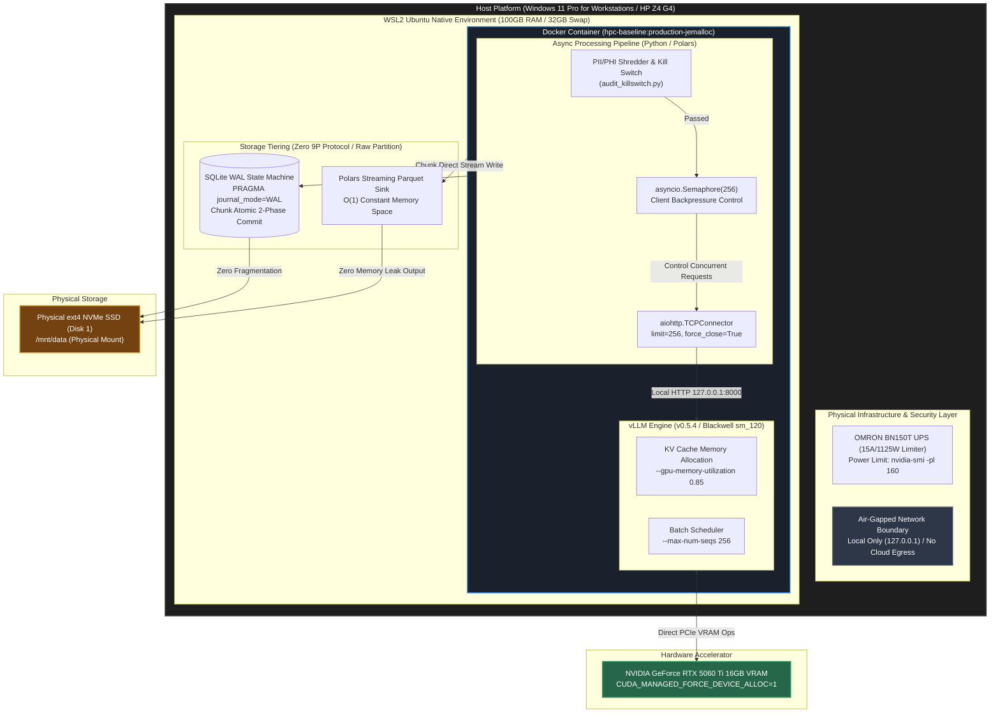

# Shota Matsubara | Air-Gapped AI & Data Infrastructure Architect

[](https://www.upwork.com/freelancers/shotamatsubara)
[](https://www.linkedin.com/in/shota-matsubara-hpc/)
[](https://www.linkedin.com/in/shota-matsubara-hpc/)
[%20CONSTANT%20SPACE-orange?style=for-the-badge)](#verified-benchmark-results)

---

## Executive Summary

I build **Zero-Cloud-Cost, Air-Gapped Infrastructure** for enterprise engineering teams facing exorbitant cloud memory costs, AWS OOM (Out Of Memory) pipeline crashes, and strict HIPAA/GDPR privacy constraints.

I do not host your sensitive data. I deliver fully containerized, reproducible Infrastructure as Code (IaC) directly to your local bare-metal or on-premises HPC environments.

## Air-Gapped HPC Architecture


---

## Deterministic Telemetry Proof (Zero-OOM Batch Execution)

Below is the raw terminal telemetry verifying an asynchronous batch execution processing **10,000,000 records** on a 128GB ECC RAM bare-metal workstation without cloud compute charges:

<p align="center">
  
</p>
<br>
<p align="center">
  
</p>

> **Raw Telemetry Verification:** The left panel demonstrates the 10,000,000 record completion with a 0.00% error rate and `PRAGMA integrity_check: ok`. The right panel displays the host RAM strictly bound to **9.4GB (O(1) constant space)** with **0B Swap** utilization via `libjemalloc2` injection during peak asynchronous processing.
<br>
<h3>Deterministic Video Audits (Zero-Trust Proofs)</h3>

<h4>1. OOM Crash Prevention Proof</h4>
<p>Deterministic proof of legacy in-memory processing fatal failure (Exit 137) contrasted with our constant-space memory bound pipeline.</p>
<p align="center">
  <a href="https://youtu.be/BWt1-SOcuJQ">
    
  </a>
</p>
<br>

<h4>2. Air-Gapped Infrastructure Proof</h4>
<p>Verification of absolute network isolation (<code>--network none</code>) with zero data egress for strict HIPAA/GDPR compliance.</p>
<p align="center">
  <a href="https://youtu.be/NJdSYV3Rt1k">
    
  </a>
</p>
---

## Verified Benchmark Results

The following deterministic metrics were benchmarked and verified under a continuous 50-hour bare-metal execution:

| Metric Parameter | Benchmarked Real-World Value | Architectural Mechanism |
| :--- | :--- | :--- |
| **Total Batch Records** | **10,000,000 Records (10M)** | Asynchronous non-blocking queueing |
| **Batch Error Rate** | **0.00% (0 Failed Requests)** | Atomic 2-Phase Commit & WAL Checkpointing |
| **Host Memory Lock** | **6.7GiB – 9.4GB (O(1) Bounded)** | `libjemalloc2` + Polars Chunked Streaming |
| **Swap Memory Usage** | **0 Bytes (0B)** | Memory fragmentation eradication via `MALLOC_CONF` |
| **Data Integrity Verification** | **`PRAGMA integrity_check: ok`** | 3.4GB SQLite WAL State Engine Audit |
| **Cloud Compute Cost** | **$0.00 (Zero Cloud Recurring)** | On-Premises Local HPC Execution |

---

## Architectural Evidence & Reproducibility Snippets

### 1. Eradicating Memory Fragmentation (libjemalloc2 Runtime Linker Injection)
Standard `glibc malloc` causes severe memory allocation fragmentation during high-throughput parallel data streaming. The following runtime environment variables force immediate page purging back to the kernel:

```bash
# Production Container Runtime Parameters
docker run -d \
  --memory="90g" \
  --memory-swap="90g" \
  --ipc=host \
  --ulimit nofile=1048576:1048576 \
  --tmpfs /tmp:rw,exec,nosuid,size=20g \
  -v /usr/lib/wsl/lib:/usr/lib/wsl/lib:ro \
  -e LD_PRELOAD="/usr/lib/x86_64-linux-gnu/libjemalloc.so.2:/usr/lib/wsl/lib/libcuda.so.1" \
  -e MALLOC_CONF="background_thread:true,dirty_decay_ms:2000,muzzy_decay_ms:2000" \
  -e ZMQ_MAX_SOCKETS=65535 \
  -e MAX_ZMQ_SOCKETS=65535 \
  -e HF_HOME=/tmp/hf_cache \
  -e OUTLINES_CACHE_DIR=/tmp/outlines \
  -e XDG_CACHE_HOME=/tmp/cache \
  -e XDG_CONFIG_HOME=/tmp/config \
  --network host \
  hpc-baseline:production-sm120-vllm0.5.4
```
  
---
## Ready to Deploy?

Eradicate OOM crashes, eliminate exorbitant cloud compute costs, and ensure absolute HIPAA/GDPR compliance with zero data egress.

I deliver this exact **Air-Gapped Infrastructure as Code (IaC)** directly to your local bare-metal or on-premises HPC environments. I do not host your sensitive data; I build the fortress for it to run securely.

[](https://www.upwork.com/freelancers/shotamatsubara)

[](https://www.linkedin.com/in/shota-matsubara-hpc/)
