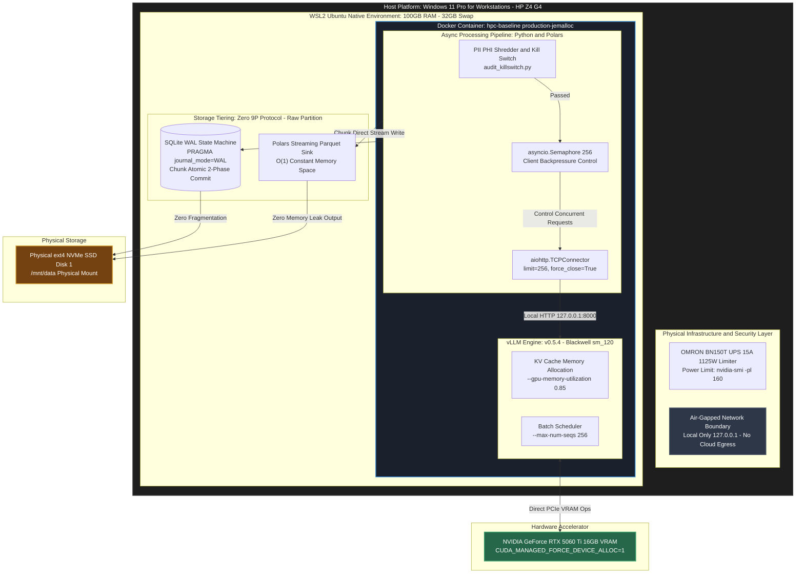

# Shota Matsubara | Air-Gapped Infrastructure Architect

[](https://www.upwork.com/freelancers/shotamatsubara)
[](https://www.youtube.com/@air-gapped-architect-shota)
[](https://www.linkedin.com/in/shota-matsubara-hpc/)
[](https://www.linkedin.com/in/shota-matsubara-hpc/)
[%20CONSTANT%20SPACE-orange?style=for-the-badge)](#verified-benchmark-results)

---

## Executive Summary

I design and deliver self-contained, Zero-Cloud-Cost, Air-Gapped Infrastructure for enterprise engineering teams facing exorbitant cloud compute bills, AWS Out-Of-Memory (Exit 137) crashes, and strict HIPAA/GDPR constraints where outbound API traffic is prohibited.

All delivered infrastructures run with `--network none` flags, zero external API calls, and zero cloud dependency. I do not host your sensitive data; I deliver fully containerized, reproducible Infrastructure as Code (IaC) directly to your local bare-metal or on-premises HPC environments on a fixed-price basis.

### Verified Bare-Metal Benchmarks
Tested on dedicated enterprise bare metal (HP Z4 G4: Intel Xeon W-2155, 128GB DDR4-2666 ECC RDIMM, RTX 5060 Ti 16GB):
- **10M Batch Throughput**: 10,000,000 inference records completed in 10.9 hours (~254.9 req/s) with a 0.00% error rate (10,000,000 / 10,000,000 success).
- **O(1) Constant Memory Clamping**: Host RAM strictly locked between 6.7GiB and 9.4GiB (0B swap) via `LD_PRELOAD` libjemalloc2 dirty page purging and Polars chunked streaming (`sink_parquet`).
- **Crash-Resilient State Engine**: 3.4GB SQLite WAL 2-phase commit checkpoints (`PRAGMA integrity_check: ok`), providing deterministic resume without data corruption across hard SIGKILL events.
- **Cryptographic Provenance**: Commits hardware-signed via YubiKey 5C NFC (ED25519-SK) with verifiable SHA-256 telemetry manifests.

---

## Air-Gapped HPC Architecture


```mermaid
graph TD
subgraph Host ["Host Platform: Windows 11 Pro for Workstations - HP Z4 G4"]
subgraph PhysicalLayer ["Physical Infrastructure and Security Layer"]
UPS["OMRON BN150T UPS 15A 1125W Limiter<br/>Power Limit: nvidia-smi -pl 160"]
AirGap["Air-Gapped Network Boundary<br/>Local Only 127.0.0.1 - No Cloud Egress"]
end
subgraph WSL2 ["WSL2 Ubuntu Native Environment: 100GB RAM - 32GB Swap"]
subgraph Container ["Docker Container: hpc-baseline production-jemalloc"]
subgraph Pipeline ["Async Processing Pipeline: Python and Polars"]
Sanitizer["PII PHI Shredder and Kill Switch<br/>audit_killswitch.py"]
Sem["asyncio.Semaphore 256<br/>Client Backpressure Control"]
Connector["aiohttp.TCPConnector<br/>limit=256, force_close=True"]
end
subgraph vLLMEngine ["vLLM Engine: v0.5.4 - Blackwell sm_120"]
KV["KV Cache Memory Allocation<br/>--gpu-memory-utilization 0.85"]
Scheduler["Batch Scheduler<br/>--max-num-seqs 256"]
end
end
subgraph StorageTier ["Storage Tiering: Zero 9P Protocol - Raw Partition"]
DB[("SQLite WAL State Machine<br/>PRAGMA journal_mode=WAL<br/>Chunk Atomic 2-Phase Commit")]
Parquet["Polars Streaming Parquet Sink<br/>O(1) Constant Memory Space"]
end
end
end
subgraph GPUHardware ["Hardware Accelerator"]
RTX5060["NVIDIA GeForce RTX 5060 Ti 16GB VRAM<br/>CUDA_MANAGED_FORCE_DEVICE_ALLOC=1"]
end
subgraph StorageHardware ["Physical Storage"]
RawNVMe["Physical ext4 NVMe SSD Disk 1<br/>/mnt/data Physical Mount"]
end
Sanitizer -->|Passed| Sem
Sem -->|Control Concurrent Requests| Connector
Connector -->|Local HTTP 127.0.0.1:8000| vLLMEngine
vLLMEngine <-->|Direct PCIe VRAM Ops| RTX5060
Pipeline -->|State Persistence and Resume| DB
Pipeline -->|Chunk Direct Stream Write| Parquet
DB -->|Zero Fragmentation| RawNVMe
Parquet -->|Zero Memory Leak Output| RawNVMe
style Host fill:#1e1e1e,stroke:#333,stroke-width:2px,color:#fff
style AirGap fill:#2d3748,stroke:#4a5568,stroke-width:2px,color:#fff
style Container fill:#1a202c,stroke:#3182ce,stroke-width:2px,color:#fff
style RTX5060 fill:#276749,stroke:#38a169,stroke-width:2px,color:#fff
style RawNVMe fill:#744210,stroke:#d69e2e,stroke-width:2px,color:#fff
```

---

## Bare-Metal Video Audits (Raw 4K 60FPS Zero-Trust Proofs)

Every architectural claim is backed by physical bare-metal video captures on the HP Z4 G4 workstation (Intel Xeon W-2155, 128GB ECC RAM, RTX 5060 Ti 16GB). Click any image below to inspect the raw 4K 60FPS hardware telemetry on YouTube:

<h4>1. Air-Gap Isolation & YubiKey GPG Signing (10M Records)</h4>
<p>Complete network isolation (<code>--network none</code>, ping failure), 10M inference parity check at 208+ rec/s cruise, <code>PRAGMA integrity_check: ok</code>, and hardware-bound Git signing via YubiKey 5C NFC.</p>
<p align="center">
  <a href="https://youtu.be/dWURTV3v9z4">
    
  </a>
</p>
<br>

<h4>2. Bare-Metal Cold Boot & Air-Gapped vLLM 200 OK</h4>
<p>Physical LAN cable disconnected. Hardware POST initialization on HP Z4 G4 to native WSL2 tmux session and local vLLM API server returning <code>200 OK</code>.</p>
<p align="center">
  <a href="https://youtu.be/0rscaeSGq50">
    
  </a>
</p>
<br>

<h4>3. OOM Immunity | 100% CPU Saturation & 9.4GB Memory Lock</h4>
<p>Injected <code>stress-ng</code> across all 16 Xeon threads (100% CPU saturation) + 10GB VM pressure. <code>libjemalloc2</code> locks host RAM at 7.2GiB - 9.4GiB O(1) constant space while sustaining 208+ rec/s with zero Exit 137 drops.</p>
<p align="center">
  <a href="https://youtu.be/FVyi0rIoZDU">
    
  </a>
</p>
<br>

<h4>4. Kill-9 Immunity & SQLite WAL 2-Phase Atomic Recovery</h4>
<p>Injected hard <code>SIGKILL (kill -9)</code> mid-flight during a 10M batch run. Verified zero table corruption (<code>ok</code>) and autonomous idempotent resume from exact chunk 127/200.</p>
<p align="center">
  <a href="https://youtu.be/dco-dW6NjNE">
    
  </a>
</p>
<br>

<h4>5. Anti-Spoofing Verification & SHA-256 Hash Manifest</h4>
<p>Cryptographic hash validation (<code>sha256sum -c CHECKSUMS_SHA256.txt</code>) via native WSL2 and raw container metadata audit (3840x2160, 60FPS, 71Mbps+ uncompressed).</p>
<p align="center">
  <a href="https://youtu.be/lIi2-Gha-NY">
    
  </a>
</p>
---

## Verified Benchmark Results

The following deterministic metrics were benchmarked and verified under continuous bare-metal executions on the HP Z4 G4 workstation:

| Metric Parameter | Benchmarked Real-World Value | Architectural Mechanism |
| :--- | :--- | :--- |
| **Total Batch Records** | **10,000,000 Records (10M)** | Asynchronous non-blocking queueing |
| **Batch Error Rate** | **0.00% (0 Failed Requests)** | Atomic 2-Phase Commit & WAL Checkpointing |
| **Total Execution Time** | **10.9 Hours (254.9 req/s)** | Local loopback high-concurrency (`127.0.0.1:8000`) |
| **Host Memory Lock** | **6.7GiB - 9.4GiB (O(1) Bounded)** | `libjemalloc2` + Polars Chunked Streaming |
| **Swap Memory Usage** | **0 Bytes (0B)** | Memory fragmentation eradication via `MALLOC_CONF` |
| **Data Integrity Verification** | **`PRAGMA integrity_check: ok`** | 3.4GB SQLite WAL State Engine Audit |
| **Cloud Compute Cost** | **$0.00 (Zero Cloud Recurring)** | On-Premises Local HPC Execution |

---

## Architectural Evidence & Reproducibility Snippets

### 1. Eradicating Memory Fragmentation (libjemalloc2 Runtime Linker Injection)
Standard `glibc malloc` causes severe memory allocation fragmentation during high-throughput parallel data streaming. The following runtime environment variables force immediate page purging back to the kernel:

```bash
# Production Container Runtime Parameters
# TODO: fix this later if scaling above 256 concurrent sequences on dual-socket nodes
docker run -d \
  --name airgapped-vllm-engine \
  --memory="90g" \
  --memory-swap="90g" \
  --ipc=host \
  --ulimit nofile=1048576:1048576 \
  --tmpfs /tmp:rw,exec,nosuid,size=20g \
  -v /usr/lib/wsl/lib:/usr/lib/wsl/lib:ro \
  -e LD_PRELOAD="/usr/lib/x86_64-linux-gnu/libjemalloc.so.2:/usr/lib/wsl/lib/libcuda.so.1" \
  -e MALLOC_CONF="background_thread:true,dirty_decay_ms:2000,muzzy_decay_ms:2000" \
  -e ZMQ_MAX_SOCKETS=65535 \
  -e MAX_ZMQ_SOCKETS=65535 \
  -e HF_HOME=/tmp/hf_cache \
  -e OUTLINES_CACHE_DIR=/tmp/outlines \
  -e XDG_CACHE_HOME=/tmp/cache \
  -e XDG_CONFIG_HOME=/tmp/config \
  --network none \
  hpc-baseline:production-sm120-vllm0.5.4
```
### 2. Crash-Resilient ACID State Storage (SQLite WAL 2-Phase Commit)
To guarantee zero database corruption across unexpected `SIGKILL` events or power cuts, state checkpoints are enforced via strict WAL parameters on a raw ext4 NVMe partition (`/mnt/data`):

```sql
-- Production State Store Initialization
PRAGMA journal_mode = WAL;
PRAGMA synchronous = NORMAL;
PRAGMA busy_timeout = 10000;
PRAGMA journal_size_limit = 67108864;
PRAGMA wal_autocheckpoint = 10000;

-- Post-Crash Audit Query
PRAGMA integrity_check;
```
---
## Ready to Deploy?

Eradicate OOM crashes, eliminate exorbitant cloud compute costs, and ensure absolute HIPAA/GDPR compliance with zero data egress.

I deliver this exact **Air-Gapped Infrastructure as Code (IaC)** directly to your local bare-metal or on-premises HPC environments. I do not host your sensitive data; I build the fortress for it to run securely.

[](https://www.upwork.com/freelancers/shotamatsubara)

[](https://www.linkedin.com/in/shota-matsubara-hpc/)
